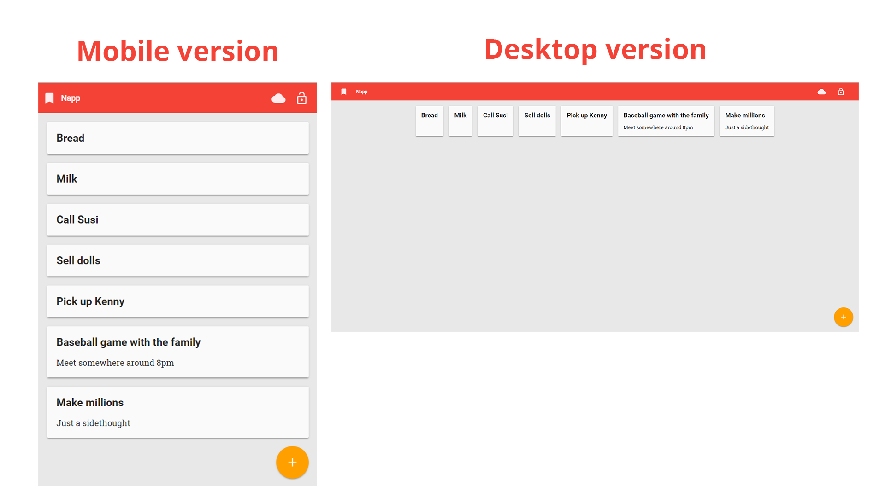

# Napp
## Summary
Napp is a simple note taking app created based off of the Google Codelab named ['Build a Progressive Web App with Firebase, Polymerfire and Polymer Components
'](https://codelabs.developers.google.com/codelabs/polymer-firebase-pwa/index.html#0).  
The app contains Google login functionality which provides you your own account to store information in.  
This way the notes sync across multiple devices, as long as you are logged in with Google.

The following technology is incorporated in this app (as hinted at by the Codelab title):
* Progressive Web App (PWA) functionality including the graceful handling of an offline client
* Firebase as a backend to store the information in
* Polymer for the user interface components

The package manager Bower is used to put it all together.

## Interface


## Run the application
Spinning up a development server (default port 5000) in localhost is as easy as running the following command:
```
firebase serve
```